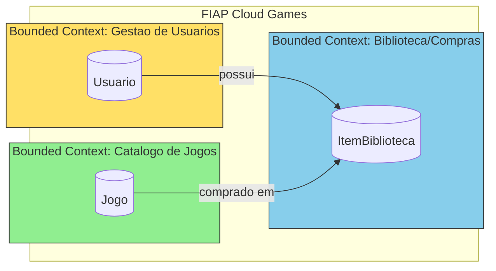
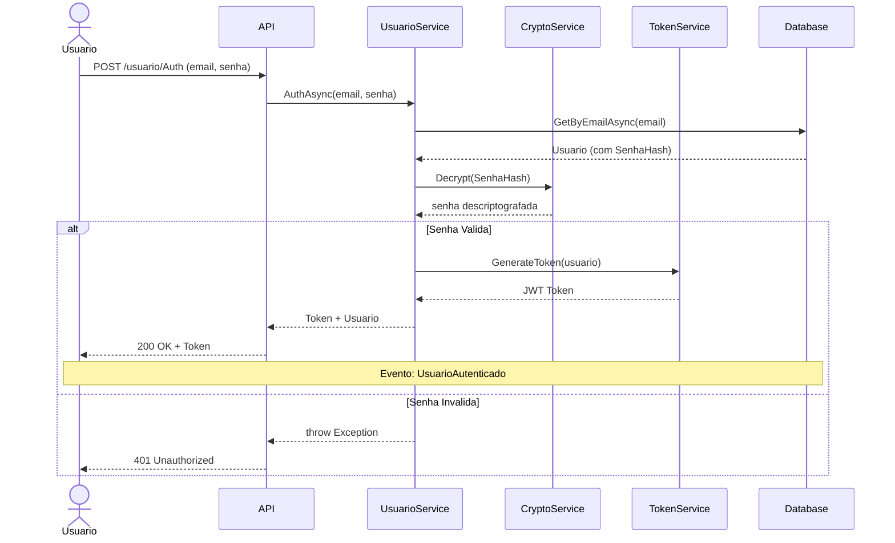
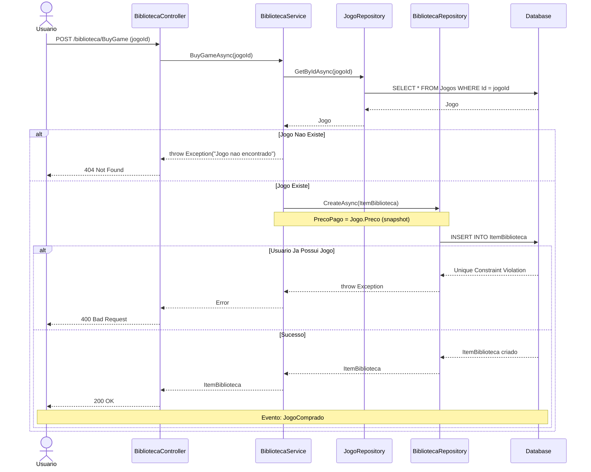
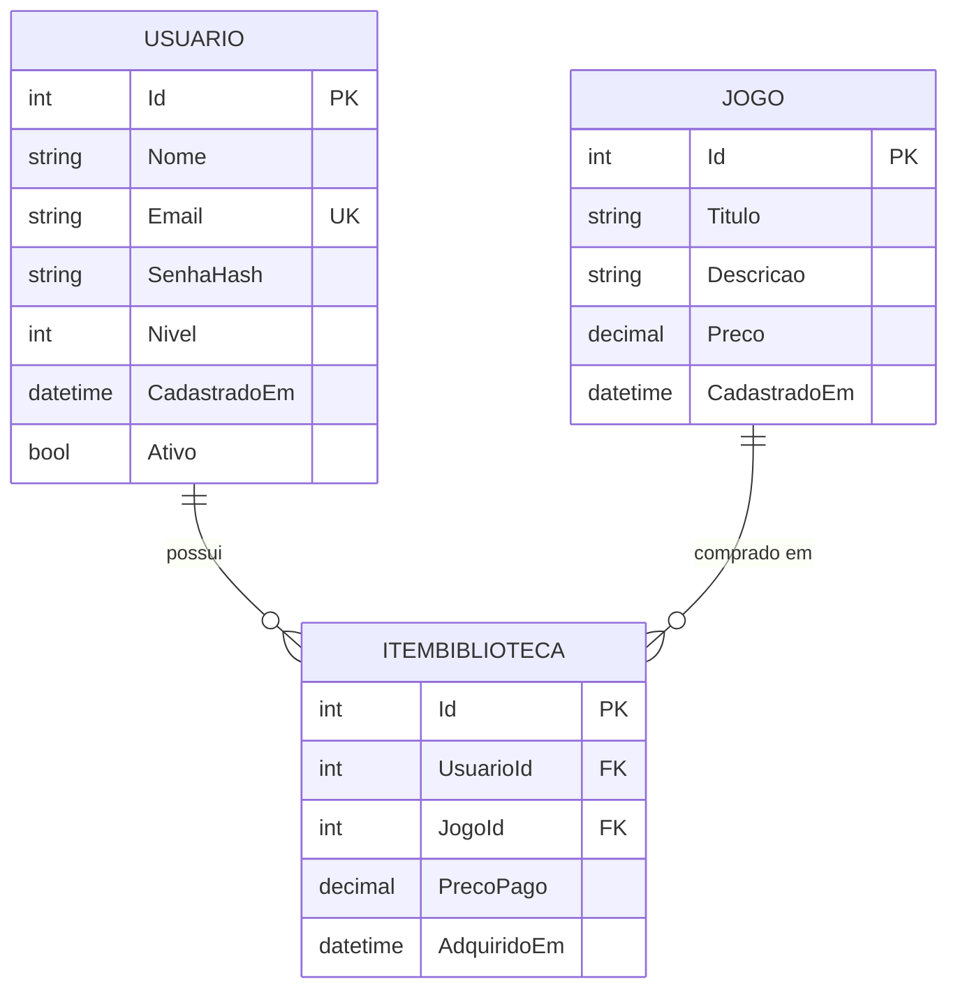
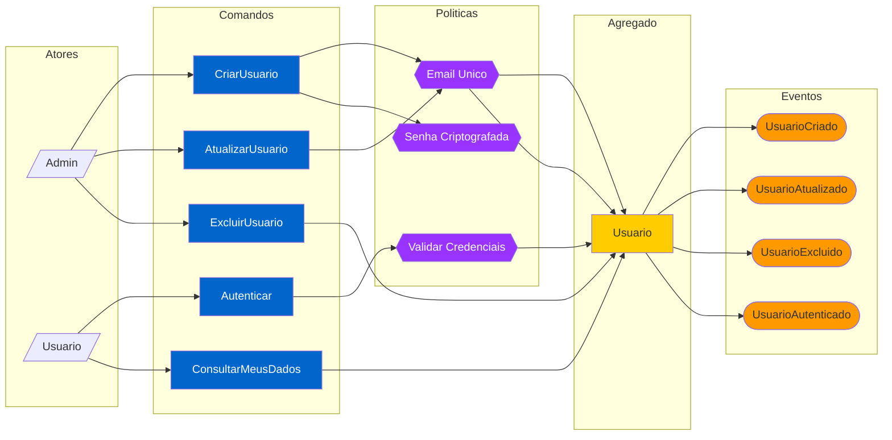
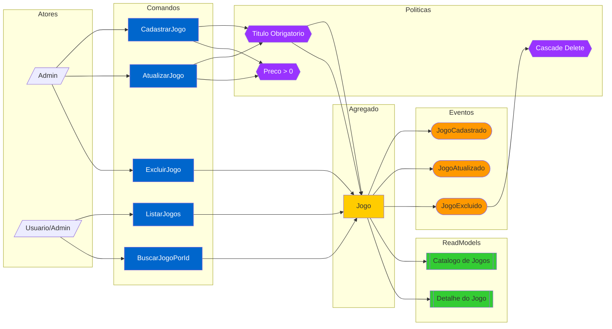
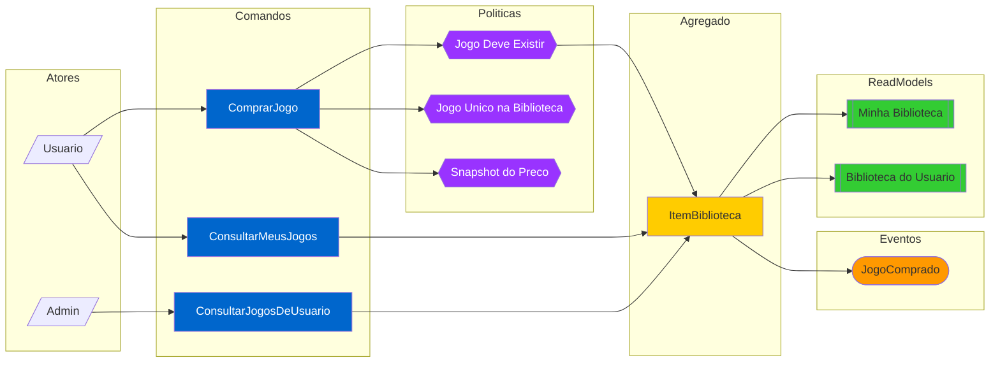
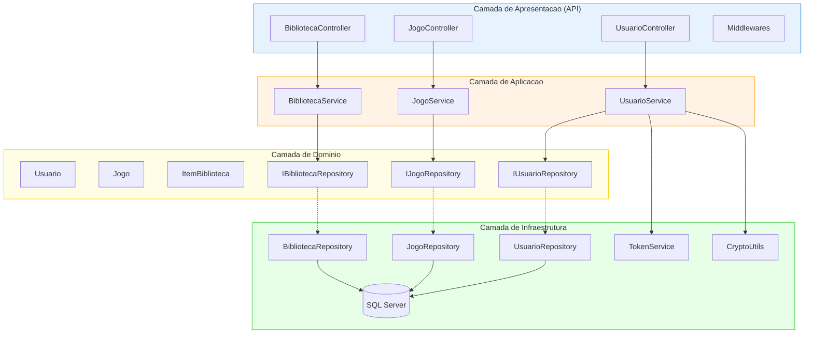
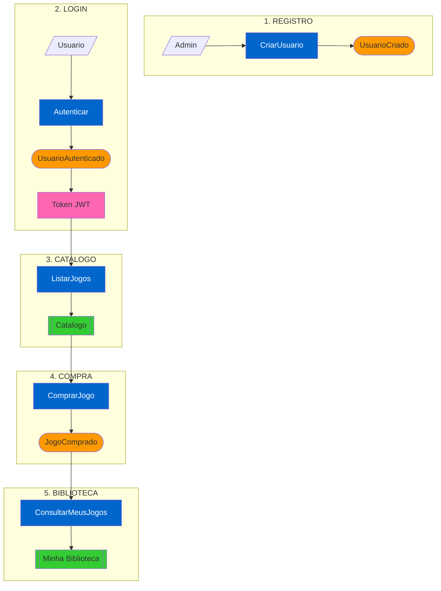
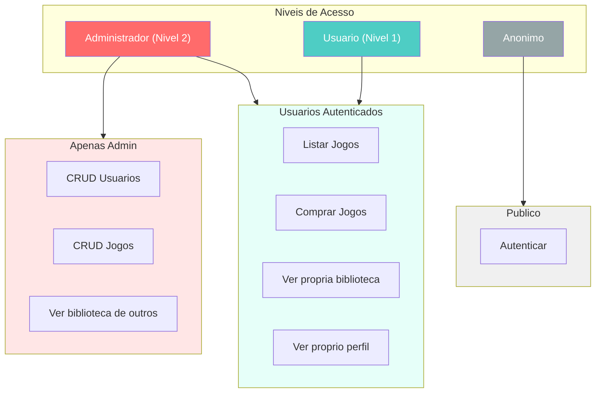

# Event Storming - Diagramas Mermaid

Este arquivo contém os diagramas do Event Storming em formato Mermaid, que podem ser visualizados no GitHub, VS Code (com extensão), ou em https://mermaid.live

---

## 1. Diagrama de Contextos (Context Map)

---

## 2. Fluxo de Autenticacao

---

## 3. Fluxo de Compra de Jogo

---

## 4. Modelo de Dominio (Entidades)

---

## 5. Fluxo de Eventos - Gestao de Usuarios

---

## 6. Fluxo de Eventos - Catalogo de Jogos

---

## 7. Fluxo de Eventos - Biblioteca/Compras

---

## 8. Arquitetura em Camadas

---

## 9. Fluxo Completo - Jornada do Usuario

---

## 10. Matriz de Permissoes (RBAC)

---

## Como Visualizar

### Opcao 1: GitHub
Basta fazer push deste arquivo para o repositorio. O GitHub renderiza Mermaid automaticamente.

### Opcao 2: VS Code
Instale a extensao "Markdown Preview Mermaid Support" ou "Mermaid Preview".

### Opcao 3: Mermaid Live Editor
Acesse https://mermaid.live e cole o codigo de qualquer diagrama.

### Opcao 4: Exportar para Imagem
No Mermaid Live Editor, voce pode exportar os diagramas como PNG ou SVG.

---

*Diagramas gerados para o Event Storming - FIAP Cloud Games*
